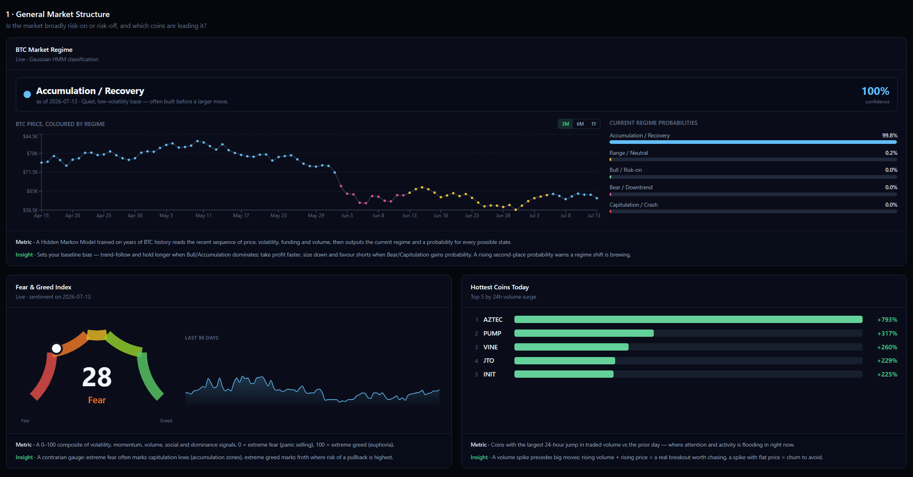
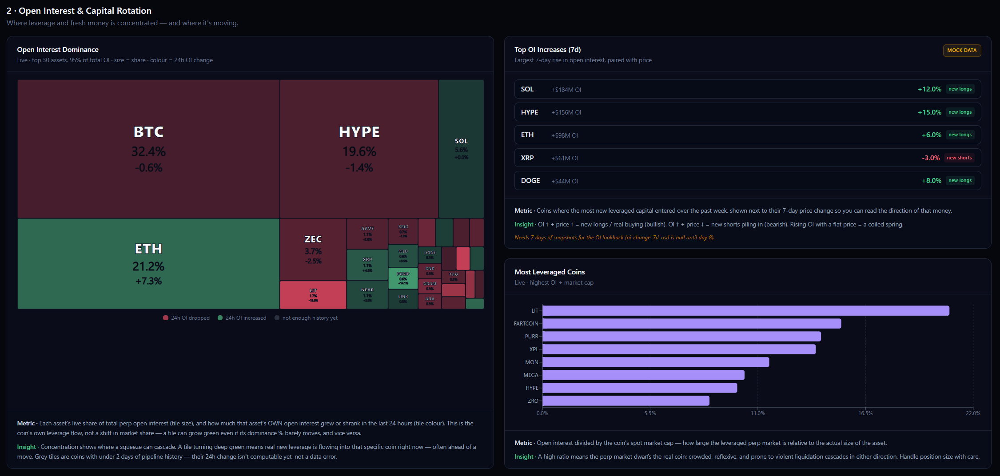
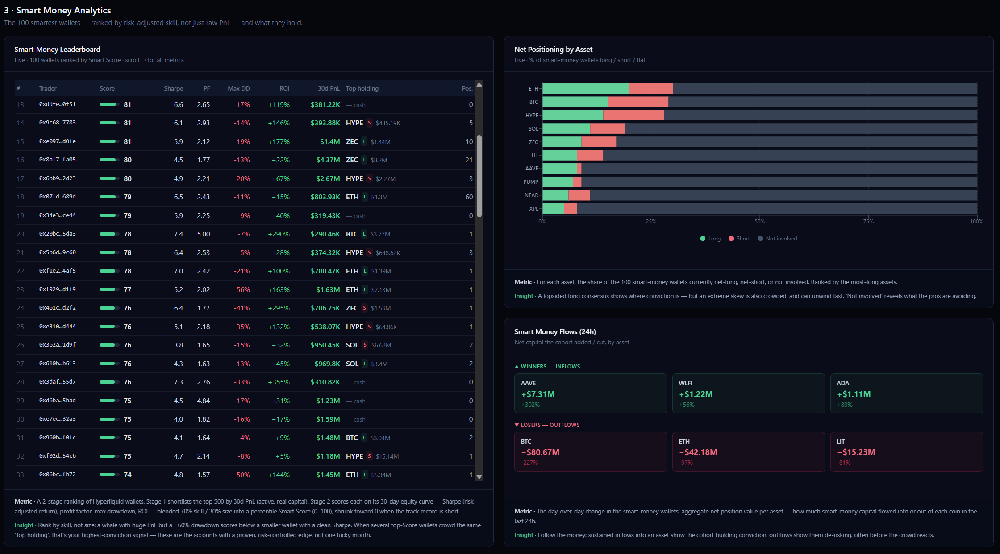
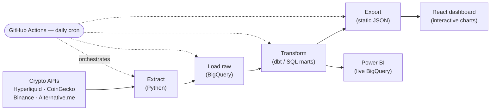
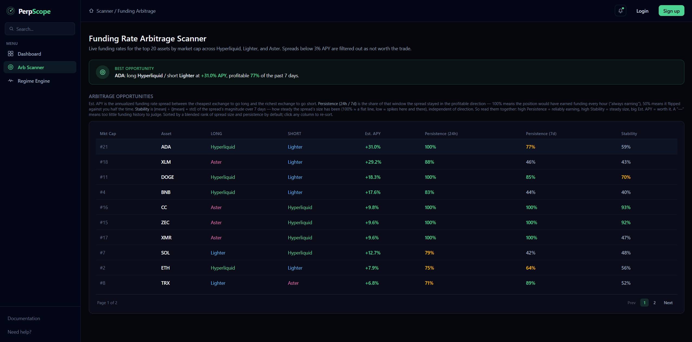
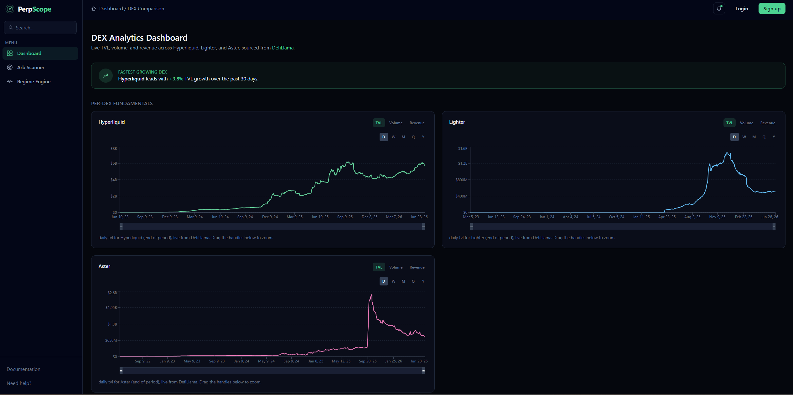
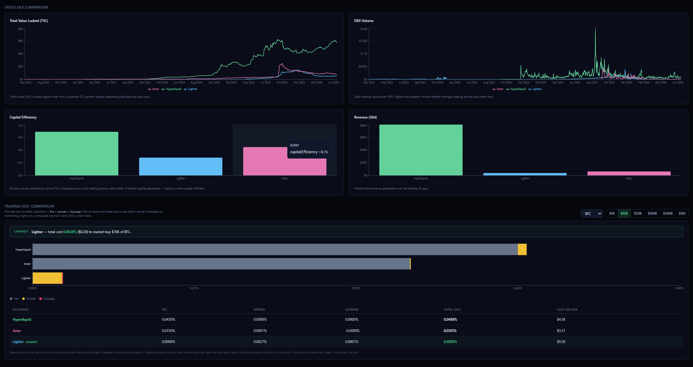

# PerpScope

**PerpScope** is a real-time analytics platform for perpetual-DEX trading. It turns live on-chain and exchange data into actionable market insight, presented on interactive charts — **capital rotation**, **smart-money analytics**, and **market-regime classification** — and pairs that with a **cross-DEX funding-rate arbitrage scanner** and a **live trading-cost comparison** across the leading decentralized exchanges.

The goal is simple: give a perps trader the three things they actually need before placing a trade — *what kind of market are we in and where is capital flowing*, *is there market-neutral yield sitting in funding spreads*, and *which exchange is genuinely the best (and cheapest) place to trade right now*.

**Stack:** React · TypeScript · Vite · Tailwind CSS · Recharts (frontend) · Python · Google BigQuery · dbt Core · GitHub Actions (data pipeline) · Power BI (BI layer). Data sourced live from Hyperliquid, Aster, Lighter, CoinGecko, Binance, DefiLlama and Alternative.me. The market-regime model is a Gaussian Hidden Markov Model trained offline in Python and run as pure inference in the browser.

---

## Feature 1 — Market Analytics Dashboard

The flagship feature. An automated **ELT data pipeline** extracts real-time blockchain and market data from **Hyperliquid** and other crypto APIs every day, transforms it into insight-ready tables, and renders it as ten interactive charts grouped into three sections. Each section answers one question in a trader's top-down workflow: *read the macro market → see where leverage is rotating → confirm with what the smartest wallets are doing.*

### The three sections

**1 · Market Structure — is the market risk-on or risk-off?**
- **BTC Market Regime** — a Gaussian Hidden Markov Model classifies Bitcoin's current regime (Bull / Accumulation / Range / Bear-Downtrend / Capitulation-Crash) with a confidence for every state, plus a BTC price chart coloured by decoded regime.
- **Fear & Greed Index** — the market's sentiment gauge with 90 days of history.
- **Hottest Coins** — largest 24h jump in traded volume (where attention is flooding in).
- **Strongest Coins** — best 30-day performance relative to BTC (momentum leaders).

  *Actionable insight:* sets the trader's baseline directional bias — trend-follow and hold longer when Bull/Accumulation dominates; take profit faster, size down and favour shorts as Bear/Capitulation probability rises. A rising second-place regime is an early warning of a shift before price confirms it.

**2 · Open Interest & Capital Rotation — where is leverage concentrated and moving?**
- **OI Dominance Treemap** — each asset's share of total open interest (tile size) and its own 24h OI change (colour).
- **Top OI Increases (7d)** — where the most fresh leveraged capital entered this week, paired with price direction.
- **Most Leveraged Coins** — open interest ÷ spot market cap, exposing crowded, liquidation-cascade-prone markets.

  *Actionable insight:* shows where a squeeze can cascade and where new leverage is genuinely flowing in — often ahead of a move. OI up + price up = new longs; OI up + price down = new shorts building; rising OI on flat price = a coiled spring.

**3 · Smart-Money Analytics — what are the best wallets actually doing?**
- **Smart-Money Leaderboard** — the top 100 wallets ranked not by raw PnL but by a **2-stage risk-adjusted score** (Sharpe, profit factor, max drawdown, ROI), with each wallet's live open positions on hover.
- **Net Positioning by Asset** — the share of the cohort long / short / flat per asset.
- **Smart-Money Flows (24h)** — day-over-day change in the cohort's net exposure per asset (capital building vs de-risking).

  *Actionable insight:* surfaces skilled, risk-controlled traders instead of lucky whales — and when several independently top-ranked wallets crowd into the same asset and direction, that convergence is the highest-conviction signal on the dashboard.

### The ETL pipeline

Every chart above is served by a self-built, fully automated pipeline rather than a single live API call. It follows the modern **ELT** pattern — Extract and Load raw data first, then Transform *inside the warehouse* with SQL — so the entire history is reproducible and auditable.

| Phase | What happens |
|---|---|
| **1 · Cloud setup** | A Google BigQuery warehouse (free tier) with three datasets — `raw` / `staging` / `marts` — and a service account for keyless CI access. |
| **2 · Extract** | Python pulls today's data from every source (open interest, volume, funding, candles, the ~40k-row trader leaderboard, wallet positions, market caps, sentiment), each tagged with a `snapshot_date`. |
| **3 · Load** | Raw records land in BigQuery via partition-truncate loads — **idempotent**, so re-running a day overwrites rather than duplicates. |
| **4 · Transform (SQL)** | **dbt** reshapes raw → staging (typed, deduped) → **marts**: six clean, reusable fact tables that feed all ten charts. Change metrics (24h / 7d / 30d) are computed with SQL window functions; smart-money wallets are ranked here. |
| **5 · Orchestrate** | A **GitHub Actions** cron runs the whole pipeline daily and unattended, then auto-commits the refreshed data export back to the repo. |
| **6 · Serve** | The marts are exported to static JSON that the **React app fetches** client-side (keyless, cached) — so every visit shows fresh data with no live warehouse queries. Power BI can also connect live to the same marts. |

> A detailed, phase-by-phase build manual with full SQL lives in [`ETL/README.md`](ETL/README.md).

---

## Feature 2 — Funding Rate Arbitrage Scanner

Scans the top tradable assets across **Hyperliquid, Lighter, and Aster** for **market-neutral funding-rate arbitrage**: go long on the exchange paying you to hold and short on the exchange charging the most, collecting the funding spread with no directional price exposure.

**Use case:** funding rates for the same asset routinely diverge across venues. When the gap is wide *and durable*, a delta-neutral trader can harvest it as low-risk carry yield. The scanner's job is to separate genuinely harvestable spreads from ones that merely look wide on a stale snapshot.

**How it works:** for each asset the scanner builds an hourly spread series (`shortLeg APY − longLeg APY`) over a rolling 7-day window — normalizing each exchange's native funding interval to a comparable rate first — then ranks opportunities on three independent dimensions:

- **Size** — the annualized spread (the raw edge).
- **Persistence** — the % of the last 24h / 7d the spread stayed in the profitable direction (`count(spread > 0) / count(window)`). *Sign-aware*: a spread that flips direction hourly scores low even if its average looks attractive.
- **Stability** — how steady the spread's *magnitude* is, independent of direction: `mean(|spread|) / (mean(|spread|) + std(|spread|))` — a t-statistic-style signal-to-noise score that trends to 1 for a flat, dependable spread and to 0 for a spiky, unreliable one.

Opportunities are filtered to a minimum annualized spread and surfaced as a "Best Opportunity" highlight plus a sortable, paginated table of every qualifying pair.

**Why it matters:** a big spread that flips sign every few hours is a trap, not an opportunity — execution risk can cost more than the funding pays. Splitting the score into *size*, *persistence*, and *stability* gives a trader the three independent pieces of information needed to size and risk-manage a market-neutral position, instead of one misleading composite number.

---

## Feature 3 — Cross-DEX Comparison & Trading Cost

Compares the leading perpetual DEXs — **Hyperliquid, Lighter, and Aster** — on both their long-term fundamentals and the real cost to trade on each *right now*.

- **Per-DEX fundamentals** — TVL (line), Volume and Revenue (bar) per exchange, with selectable granularity (Daily / Weekly / Monthly / Quarterly / Yearly) and a zoom slider.
- **Cross-DEX comparison** — TVL, volume, capital efficiency, and 30-day revenue charted across all three exchanges at once, plus a "Fastest Growing DEX" callout.
- **Trading Cost Comparison** — for a chosen asset and trade size, computes the *true* all-in cost to trade on each exchange: **taker fee + spread + slippage**, with spread and slippage calculated live from each exchange's real order book (via a VWAP book-walk), not estimated. Surfaces the cheapest venue for that specific trade — and flags any venue too thin to fill the size.

**Why it matters:** Tracking TVL / volume / revenue over time shows whether a DEX's fundamentals are genuinely *growing* — deepening liquidity and real usage — versus stagnating or shrinking, which is the basis for deciding which exchange to trust with size and stay on long-term. Separately, raw fee schedules don't tell you the real cost of a trade *right now* — a "0% fee" exchange can still be more expensive than a 5bp-fee exchange once spread and slippage on a thin order book are accounted for. The Trading Cost Comparison answers that immediate question directly, letting a trader pick the cheapest venue *for their actual order size* before they place it.

---
