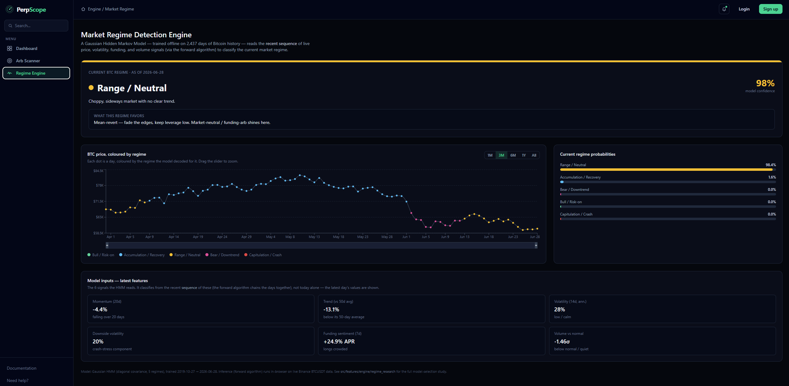

# PerpScope

**PerpScope** is a real-time analytics platform for perpetual DEX trading, built to help compare exchanges, find cross-venue arbitrage, and read the current market regime — all from live on-chain and exchange data.

It's a React + TypeScript single-page app covering three independent features, each solving a distinct problem a perps trader actually faces: *which exchange is best right now*, *is there free money in funding spreads*, and *what kind of market are we in*.

**Stack:** React, TypeScript, Vite, Tailwind CSS, Recharts. Data sourced live from DefiLlama, Hyperliquid, Aster, Lighter, Binance, and CoinGecko APIs. The market-regime model is a Gaussian Hidden Markov Model trained offline in Python and run as pure inference in the browser.

---

## Feature 1 — DEX Analytics Dashboard

Compares **Hyperliquid, Lighter, and Aster** side by side on the fundamentals that determine where a trader should actually route order flow: **TVL, volume, revenue, capital efficiency, and trading costs.**

- **Per-DEX fundamentals** — TVL (line), Volume and Revenue (bar) charts per exchange, with selectable granularity (Daily/Weekly/Monthly/Quarterly/Yearly) and a zoom slider.
- **Cross-DEX comparison** — TVL, volume, capital efficiency, and 30-day revenue charted across all three exchanges at once, plus a "Fastest Growing DEX" callout.
- **Trading Cost Comparison** — for a chosen asset and trade size, computes the *true* cost to trade on each exchange: **taker fee + spread + slippage**, with spread and slippage calculated live from each exchange's real order book (not estimated). Surfaces the cheapest venue for that specific trade.

**Why it matters:** Tracking TVL/volume/revenue over time shows whether a DEX's fundamentals are genuinely *growing* — deepening liquidity and real usage — versus stagnating or shrinking, which is the basis for deciding which exchange to trust with size and stay on long-term. Additonally, raw fee schedules don't tell you the real cost of a trade *right now* — a "0% fee" exchange can still be more expensive than a 5bp-fee exchange once spread and slippage on a thin order book are accounted for. The Trading Cost Comparison among the decentralized exchanges answers that immediate question directly, letting a trader pick the cheapest venue *for their actual order size* before they place it.

---

## Feature 2 — Funding Rate Arbitrage Scanner

Scans the top tradable assets across Hyperliquid, Lighter, and Aster for **market-neutral funding-rate arbitrage**: going long on the exchange paying you to hold, and short on the exchange charging the most — collecting the funding spread with no directional price exposure.

- Ranks opportunities by annualized spread, **persistence** (the % of the last 24h/7d the spread stayed in the profitable direction), and **stability** (a t-statistic-style score for whether the spread size is steady or spiky, independent of direction).
- Surfaces a "Best Opportunity" highlight and a sortable, paginated table of every qualifying pair.

**Why it matters:** a big spread that flips sign every few hours is a trap, not an opportunity — it can cost more in execution risk than it pays in funding. Splitting the score into *size*, *persistence*, and *stability* gives a trader the three independent pieces of information actually needed to size and risk-manage a market-neutral position, instead of one misleading composite number.

---

## Feature 3 — Market Regime Detection Engine

Classifies the **current Bitcoin market regime** — Bull / Accumulation / Range / Bear-Downtrend / Capitulation-Crash — using a **Gaussian Hidden Markov Model** trained offline on ~6 years of BTC price, volatility, and funding-rate history, then run as live inference in the browser against current Binance data.

- **Current regime card** — the model's top regime call with its confidence (posterior probability), plus a plain-English description and trading guidance for that regime.
- **Regime-coloured BTC price chart** — full history from 2019, zoomable, with every day coloured by its decoded regime so you can see how the model read past cycles (e.g. the 2020 COVID crash, the 2021 and 2024 bull runs).
- **Model inputs panel** — the live values of the six features driving the call: 20-day momentum, trend vs. 50-day average, realised and downside volatility, funding-rate sentiment, and volume z-score.
- A full **model-selection research notebook** (`src/features/engine/regime_research/`) documents why an HMM was chosen over K-Means, Agglomerative clustering, and a Gaussian Mixture Model — explained with hyperparameter tuning, time-series cross-validation, and an honest discussion of trade-offs.

**Why it matters:** the right trading strategy depends entirely on the regime — trend-following works in a bull market and gets chopped up in a range; mean-reversion works in a range and gets run over in a crash. Rather than predicting price, this feature answers the prior, more tractable question of *what kind of market this is*, so a trader can match their strategy to current conditions instead of guessing.

---
